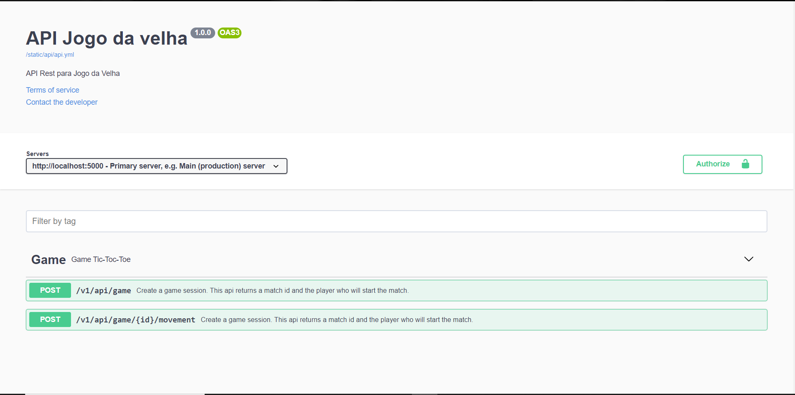

# API Rest Jogo da Velha
API for game applications

## Installation
  - Install [Python](https://www.python.org/downloads/), [Pipenv](https://docs.pipenv.org/) on your machine

  - Rename the file `.env.example` to `.env`
  - Configure your file
    - Default setting
    ```
    SECRET_KEY= _5#y2L"F4Q8z\n\xec]/
    APP_PORT= 5000
    APP_HOST= 0.0.0.0
    FLASK_ENV= development
    ```
  - Activate or create the project virtual environment with `$ pipenv shell` 
  - `install -r requirements.txt` to install dependencies
  - Execute the comand `pytest --cov=src --cov-config .coveragerc` for verify create game session
  - Start the app locally with `python run.py`
  - The application should be available at the address `http://localhost:5000/`
  - To access endpoint documentation `http://localhost:5000/apidocs/`

  - You should see a documentation page like this
  

## Migration
  - Does not have models

## Deploy

## Compatibility
* [Developed with Python 3]

Notes
=================
- If you install new dependencies, remember to update the application file. Use the command `pip freeze > requirements.txt`
- Code based on PEP 8 -- Style Guide for Python Code
- In case of new features remember to check good practices and check for possible bugs. For verification with specific modules use the command `pylint module_name.py` or `pylint path\module_name.py`
- In the specs folder there is a pdf document explaining the development of the project
